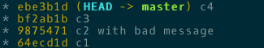

= Git from zero to hero: 2. Fusionner, déplacer des branches et des commits
:Author: Bastien Bonnet, Alexandre Dergham
:toc:
:numbered: 1

== Pré-requis

. Avoir Git installé

. Récupérer le projet en local

	git clone https://github.com/bastien-bonnet/xke-git-from-zero-to-hero-part-2.git

. Se placer dans le répertoire du projet cloné

	cd xke-git-from-zero-to-hero-part-2

. Pour visualiser l'historique des commits sous forme de graphe compact, nous rajoutons un alias `git l`:

	git config alias.l 'log --graph --oneline --color --decorate --all'
+
N'hésitez pas à utiliser cet alias avant et après chaque commande de l'atelier pour bien visualiser les changements apportés par chaque commande lancée.
+
Pour utiliser l'alias que nous venons de définir (ne fonctionne que pour le projet git dans lequel nous l'avons déclaré) :

	git l

== Introduction
=== Programme de l'atelier

Ceci est le deuxième atelier d'une série de trois sur l'utilisation de Git

Les objectifs de cette séance sont d'apprendre à :

* manipuler et « déplacement » de commits
* utiliser `merge` et `rebase`
* résoudre des cas pratiques rencontrés en projets

=== Préambule
Avant de commencer, nous allons définir quelques points clés à garder en tête pendant toute la durée de l'exercice :

* Un commit Git est immuable. Quoi qu'il arrive, même si vous avez l'impression qu'un commit a disparu, a été modifié ou a été déplacé, gardez à l'esprit qu'**un commit git ne peut jamais être modifié**, que ce soit au niveau de son contenu, son message descriptif ou ses parents.
* **Un commit git est unique**. Cette unicité est garantie par son identifiant généré à sa création sous la forme d'une clé SHA1.
* À la manière d'une instance d'objet Java, un commit Git reste accessible (visible dans l'historique) tant qu'il est référencé par un tag, une branche ou le HEAD ou tant qu'il est le parent d'un autre commit visible.
* Toujours à la manière de Java, il est possible de détruire définitivement un commit en appelant un garbage collector avec la commande `git gc` à condition que ce commit ne soit plus visible. Notez que qu'il n'est pratiquement jamais utile ni recommandé d'utiliser cette commande.

== Exercices

=== Identifier un commit et se déplacer dans l'arbre de révisions :  la distinction entre checkout, reset et revert
Dans cette section, nous allons voir comment utiliser les commandes `checkout`, `reset` et `revert`, qui permettent de se déplacer dans le graphe des révisions. Ces commandes vont prendre en argument un élément pemettant d'identifier le commit que vous ciblez. Il existe plusieurs façons d’identifier un commit dans une commande Git :

* nom de la branche associée, par exemple `git checkout ma-branche` que vous connaissez déjà.
* identifiant du commit. Il s'agit de la clé SHA1 du commit (visible avec certaines commandes comme  `git reflog`, `git log` ou notre alias `git l`)
* relativement à un autre commit en utilisant les operateurs `~` et `^`:
** 1 commit antérieur au HEAD sur son 1er parent (Et oui ! En cas de merge, un commit peut avoir 2 parents ^^) : `HEAD~` ou `HEAD^`
** 2 commits antérieur à HEAD sur son 1er parent: `HEAD~~` ou `HEAD~2`
** 42 commits antérieurs à HEAD sur son 1er parent: `HEAD~42`
** 1 commit antérieur à HEAD sur le 2ème parent : `HEAD^2`
** 3 commits antérieurs à HEAD sur le 2ème parent: `HEAD~3^2`
** 1 commit antérieur au dernier commit de ma-branche : `ma-branche~` (Oui ! Ça aussi, c'est possible !)

En terminologie Git, `HEAD` fait référence au commit sur lequel vous avez commencé votre travail. Il s'agit d'un pointeur, au sens programmation, sur un commit présent dans l'historique, qui représente votre « point de départ » pour votre développement.

==== Checkout
`git checkout` permet de restaurer l'état du système de fichiers, aussi appelé copie de travail, à un commit donné en déplaçant uniquement le HEAD de git. 

Vous pouvez prendre 5 minutes et jouer avec la commande `git checkout` en utilisant ces méthodes d'identification de commit. Terminez par un `git checkout master` pour vous remettre au bon endroit pour la suite de l'atelier.

==== Reset
`git reset` deplace une référence de branche sans modifier le contenu du système de fichiers.

Utilisation de base de reset :

* `git checkout master` (on appelera par la suite ce commit r0)
* modifier fichier `a.txt` et commiter : `git add .` puis `git commit -m "r1"` 
* Observer que votre commit `r1` s'est bien rajouté à l'historique : `git l`
+

* `git reset HEAD~1` (r0 si vous avez bien suivi)
* `git status` : La référence de la branche master s’est déplacée d’un commit en arrière (r0) mais le système de fichiers reste dans l’état du commit r1. Du coup, git status considère l’état actuel du système de fichiers comme différent de son commit actuel.
* `git diff` : vous voyez la différence entre le commit et l’état du système de fichiers
Note : si vous voulez déplacer une référence de branche vers un commit rx et rétablir le file system à l’état du commit rx, utiliser `git reset --hard`
* `git l` : vous voyez que le commit r1 a disparu et que HEAD et master correspondent au commit r0 :
+

+
En réalité, le commit r1 existe toujours mais n'est plus référencé par la branche master.

==== Reflog
`git reflog` affiche la liste des opérations qui ont eu lieu dans votre arbre de révision local.
Ainsi, nous pouvons retrouver la clé SHA1 d’un commit perdu avec la commande git reflog et nous pouvons rétablir un commit perdu si on connait sa clé SHA1  (`git checkout mySHA1`  puis `git branch`).

Nous allons utiliser reflog et reset pour rendre à un commit disparu son référencement :

* `git reflog` pour faire apparaitre le commit r1 que nous venons de déréférencer (juste avant de lancer la commande `git reset`, soit la clé de la deuxième ligne affichée par reflog.).
* `git reset <SHA1_du_commit_r1>` : la référence de master est repositionnée sur le commit r1 (sans modifier le système de fichiers.) 
* Vérifier le résultat avec `git l` :
+

==== Revert
Cette commande crée un nouveau commit, modifiant le système de fichier, qui inverse les modification d'un commit:

* `git revert HEAD` : on crée un nouveau commit après r1 qui inverse les modifications de r0 vers r1.
* Constater le résultat avec `git l` :
+

Avec votre nouvelle maitrise de `checkout`, `reset` et `reflog`, vous êtes maintenant capables, si vous commetez une erreur de manipulation, de revenir à l'état antérieur que vous souhaitez :)

=== Merge
==== Explication
La commande `merge` crée un commit supplémentaire qui réunit le dernier état de deux branches. 

* Avantage : l'historique montre que les deux développements ont été effectués en parallèle. 
* Inconvénient : plus il y a de merge, plus l'historique est compliqué à lire et comprendre.

==== Exercice
* positionner HEAD sur master : `git checkout master`
* creer une branche `git branch ma-branche` puis `git checkout ma-branche` (par la suite, vous obtiendrez le même résultat avec la commande `git checkout -b ma-branche`)
* modifier un fichier puis commiter : `git add .` puis `git commit -m "modif dans ma branche"`
* retour sur la branche master : `git checkout master`
* modifier un autre fichier puis commiter : `git add .` puis `git commit -m "modif dans le master"`
* constater que les deux branches ont divergés avec `git l` :
+

* merge de la branche sur master : `git merge ma-branche`
* affichage de l'arbre des commits : `git l`
+

On peut observer que le résultat du `merge` est un commit supplémentaire, réunissant les deux branches.

=== Rebase
==== Explication
La commande `rebase` permet de « déplacer » les commits d'une branche sur une nouvelle branche ou un nouveau commit. ceci permet d'appliquer les modifications d'une branche sur une autre branche.

* Avantage : l'historique est linéaire est simple à comprendre.
* Inconvénient : le fait que le développement de  deux branches aient été fait en parallèle n'apparaît plus sur l'arbre de révisions.

==== Exercice
* positionner HEAD sur master : `git checkout master`
* creer une branche puis se positionner dessus :  `git checkout -b mon-autre-branche`
* modifier un fichier puis commiter : `git add .` puis `git commit -m "modif dans ma branche"`
* retour sur la branche master : `git checkout master`
* modifier un autre fichier puis commiter : `git add .` puis `git commit -m "modif dans le master"`
* constater que les deux branches ont divergés avec `git l` :
+

* rebase de la branche sur master : `git checkout mon-autre-branche` puis `git rebase master`
* affichage de l'arbre des commits : `git l`
+

On remarque les commits de `mon-autre-branche` ont été « déplacés » sur ceux de master.

[NOTE]
====
la commande `rebase` applique les modifications de chaque commit de la branche courante sur la cible. Ces modifications sont traitées commit par commit. Ce qui veut dire qu'on résout les conflits commit par commit au lieu de comparer l'état final d'une branche avec celle d'une autre (comme le ferait la commande `merge`).

La commande `rebase` ne déplace pas une branche, cette commande recrée de nouveaux commits en appliquant les modifications successives d’une branche sur un autre commit (référencé par une branche, tag ou sa clé SHA1). C'est pourquoi, après rebase, des commits paraissent avoir changé d'identifiant (clé SHA1) : en réalité il s'agit de nouveaux commits qui reproduisent les mêmes changements.

Une fois les commits créées, la référence de la branche est déplacée sur ces commits, ce qui donne l’illusion que la branche a été déplacée.
Si on rajoute une autre référence de branche sur la branche « rebasée », alors les commits restent référencés après le rebase et restent visibles.

Il est fortement déconseillé d'utiliser cette commande sur une branche qui a déjà été persistée sur le dépôt distant (voir la mise en situation 4).
====

=== rebase --interactive ou rebase -i : Réécrire l'histoire d'une branche

* positionner HEAD sur master : `git checkout master`
* modifier un fichier `a.txt` et commiter : `git add .` puis `git commit -m "c1"` 
* modifier un fichier `b.txt` et commiter avec un mauvais message : `git add .` puis `git commit -m "c2 with bad message"` 
* modifier le fichier `a.txt` et commiter : `git add .` puis `git commit -m "c3"` 
* modifier les fichiers `c.txt` et `d.txt` et commiter : `git add .` puis `git commit -m "c4"` 
* observer l'état actuel avec `git l` :
+

* initier la réécriture de histoire des 4 derniers commits : `git rebase -i HEAD~4`
* un texte apparait à l'écran et est edité par vim (ou votre éditeur de texte paramétré par la variable d'environnement `EDITOR`). Les 4 premières lignes de ce texte représentent les 4 derniers commits que vous venez de faire. Ces commits sont identifiés par une clé SHA1 et une commande d'action par défaut `pick`. Ceci veut dire que l'historique de vos sources tient compte de ces 4 commits en l'état. À partir de là, il est possible d'effectuer les actions suivantes :
** déplacer le commit c3 juste en dessous de c1 et déplaçant toute la ligne qui fait référence à c3. Cela aura pour effet de modifier l'ordre des commits dans l'historique.
** fusionner c1 et c3 en conservant le message de commit de c1. Pour cela, il vous suffit de remplacer le mot clé `pick` par `f` ou `fixup` à la ligne correspondant au commit c3 après l'avoir déplacé en dessous de c1.
** Pour corriger le message de commit de c2, il faut remplacer le mot clé `pick` par `r` ou `reword` devant ce commit 
** Pour séparer c4 en 2 commits : remplacer le mot clé `pick` par `e` ou `edit` devant ce commit. Cela indique qu'au moment de réécrire l'historique, git interrompera sa réécriture pour vous rendre la main et vous permettre de modifier le commit c4.
** une fois le texte modifié, sauvegarder le document en cours d'édition, qui doit ressembler à ceci :
+

* git va reconstruire une nouvelle branche en prenant les différents commits que vous avez listés dans le document et en leur appliquant les différentes opérations que vous avez déclarées (fixup, reword et edit).
* une fois c1 et c3 automatiquement fusionnés par git, celui-ci vous invite à ressaisir le texte de commit de c2.
* une fois le texte de c2 saisi et enregistré, git inclut le commit c4 à la nouvelle branche mais ne finalise pas la réécriture d'historique. Vous avez la main pour faire les actions suivantes :
** `git l`: vous constatez qu'une nouvelle branche est en cours de création mais qu'elle ne porte pas encore de référence :
+

** deplacer la référence de HEAD au commit précédent sans modifier le système de fichiers : `git reset HEAD~`
** constater que les fichiers `c.txt` et `d.txt` sont modifiés par rapport au commit courant (c2 si vous avez bien suivi) : `git status`
** créer un commit spécifique pour le fichier `c.txt` : `git add c.txt` puis `git commit -m "c4.1"` 
** créer un commit spécifique pour le fichier `d.txt` : `git add d.txt` puis `git commit -m "c4.2"`
** une fois les 2 commits créés, vous devez indiquer à git que la réécriture d'histoire est terminée : `git rebase --continue`
* `git l` : la référence de la branche master a été déplacée sur le dernier commit de votre nouvelle branche :
+

== Exercices cas pratiques : mises en situation

=== Situation 1 : valider l'intégration de 2 features sans mettre en péril ma branche master
==== Description 
J'ai 2 features A et B respectivement écrites dans les branches b-A et b-B en plus de la branche master (ce qui nous fait un total de 3 branches).
Je souhaite valider que l'intégration de la feature A à la feature B fonctionne sans regression mais pour autant, aucune de ces feature ne doit être poussée sur la branche master avant que cette validation n'ait été faite.

==== Mise en situation

* Créer une branche `b-A`
* Modifier `a.txt`
* Commit
* Créer une branche `b-B`
* Modifier `b.txt`
* Commit

Votre graphe de révisions doit ressembler à :

==== Solution

* Je crée une nouvelle référence de branche sur la feature A : `git checkout b-A` puis `git checkout -b b-A-2`
* Je rebase b-A-2 sur b-B : `git rebase b-B`
* Ainsi, mes référence de branche b-A et b-B ne sont pas alterées et j'ai désormais un branche b-A-2, fille de b-B qui intègre les développements des features A et B :
+

+
Je peux ainsi tester cette intégration en local.

Si on veut aller plus loin et conduire des tests d'intégration sur cette nouvelle branche, il suffit de pousser cette branche sur le dépot distant de référence avec `git push origin b-A-2` et de faire en sorte que le système d'intégration continue builde le projet à partir de cette branche au lieu de master.

Pour nettoyer votre dépôt à la fin de cet exercice, effacez les branches créées :

	git checkout master
	git branch -D b-A b-A-2 b-B

=== Situation 2 : J'ai rajouté un commit par erreur sur la branche master

==== Description
J'ai rajouté un commit sur la branche master au lieu d'en faire une nouvelle branche. En temps normal, développer une nouvelle feature implique de créer une nouvelle branche dédiée à cette feature.
Je viens de créer mon commit et mon HEAD pointe toujours sur la branche master.

==== Mise en situation

Faire une modification sur `master` et commit :

==== Solution

* Je rajoute la référence de ma branche b-A dédiée sur mon nouveau commit : `git branch b-A`
* Je déplace la référence de la branche master au commit précédent et je restaure le système de fichiers à l'état précédent du master : `git reset HEAD~1 --hard`
* Nous obtenons bien une branche master restaurée à son état précédent et une nouvelle branche b-A dédié à ma feature et fille du dernier commit du master :
+

Pour nettoyer votre dépôt à la fin de cet exercice, effacez les branches créées :

	git branch -D b-A

=== Situation 3 :  créer une branche sur la mauvaise branche
==== Description 
Je crée et développe une branche B2 sur la branche  B1 au lieu de la créer à partir de la branche master :

De cette manière, si je tente la commande `git rebase master` à partir de la branche B2, je déclenche aussi un rebase de B1 sur la branche master (ce qui n'est pas souhaité) :

Cela ce produit car les commits de B1 appartiennent aussi à B2.

==== Mise en situation
* créer la branche B1, et la checkout : `git checkout -b B1`
* modifier `a.txt` et commit : `git commit -am "mod a.txt"`
* modifier `b.txt` et commit : `git commit -am "mod b.txt"`
* créer la branche B2, et la checkout : `git checkout -b B2`
* modifier `c.txt` et commit : `git commit -am "mod c.txt"`
* modifier `d.txt` et commit : `git commit -am "mod d.txt"`
* repasser sur master : `git checkout master`
* créer un fichier `e.txt`, le add (`git add e.txt`) et commit : `git commit -m "mod a sur master"`

Vérifier que le graphe de révisions ressemble à ceci :

On observe que B2 a bien été déplacée, sans embarquer B1 qui est restée à sa place, ce qui n'aurait pas été le cas avec un rebase classique.

==== Solution
La solution est d’utiliser rebase avec l'option `--onto`, qui permet de sélectionner des « morceaux » de branches avec la syntaxe suivante :

	git rebase --onto BRANCHE-CIBLE PREMIER-COMMIT DERNIER-COMMIT

Ce qui, dans notre cas, se traduit par :

	git rebase --onto master B1 B2

Et produit le résultat suivant :

=== Situation 4 : J'ai modifié la référence d'une branche distante et mes équipiers perdent les références à cette branche
==== Description

Vous vous souvenez qu'on vous a dit de ne jamais utiliser la commande rebase sur une branche qui a déjà été persistée sur le dépôt distant ? Voici une situation qui peut avoir lieu si vous ne respectez pas cette bonne pratique.

Soit une branche bX déjà poussée sur le dépôt origin et une branche master qui a évolué depuis la création et la persistance de cette branche. Cette branche bX prend racine sur la branche master au niveau du commit c0.

je lance les commandes suivantes : `git checkout bX`, `git rebase master`, `git push origin bX --force`.

Ce faisant, je force mon dépôt distant à déréférencer ma précédente branche bX pour en créer une nouvelle qui est issue du dernier commit de la branche master c1.

Si j'étais seul sur mon projet, cette opération n'aurait eu aucun impact visible parce que ma nouvelle branche distance est correctement référencée et associée à la nouvelle branche sur le dépôt distant...

Malheureusement, je ne suis pas seul et mes équipiers commencent à venir me voir un par un pour me demander pourquoi les commits qu'ils ont rajoutés sur leur branche bX en local n'existent plus depuis qu'ils ont lancé la commande `git pull`....

==== Solution

Avant de proposer une solution, nous allons revenir un moment sur ce qui vient de se passer:

En temps normal, git ne permet pas de pousser un changement de référence de branche sur un dépôt distant mais l'option --force de push permet d'outrepasser cette sécurité. Cette option force git à déréférencer l'ancienne branche bX distante pour en créer une nouvelle qui va porter cette référence.
Jusque là, tout va bien. Mon dépot local est synchronisé avec le dépôt distant.

Cependant, un de mes équipiers a rajouté un commit sur sa version locale de la branche bX et tente de pousser cette modification de la branche sur le dépôt. Celui-ci lui réponds que la branche bX prenant racine en c0 n'existe plus. 
A ce moment là, mon équipier a 2 solutions:

* Forcer à son tour un push sur la branche bX qui aurait pour effet de rétablir la branche qui prend racine en c0.
* Récupérer la nouvelle référence de branche à l'aide d'un `git pull` pour y inclures ses modifications locales avant de la pousser sur le dépôt.

Vous l'aurez compris, la première solution (d'un bourrinisme achevé) est à éviter car elle ne résout rien de manière durable puisque je serais à mon tour victime d'une incohérence entre ma branche locale et celle du dépôt.

Nous allons maintenant explorer ensemble la deuxième solution:

* Mon équipier récupère la nouvelle référence de bX: `git pull origin bX`
* La nouvelle référence de bX apparait dans l'arbre de révision local mais la précédente branche locale a disparue avec le commit que l'équipier souhaitait pousser sur le dépôt.
* Dans un premier temps, il faut retrouver la clé du commit à récupérer. Pour cela, nous allons utiliser `git reflog`.
* Une fois cette commande exécutée, on recherche la clé correspondant à ce commit (vraisemblablement juste avant l'execution de `git pull`)
* Maintenant que la clé est retrouvée, il ne reste plus qu'à demander à git de reporter les modification appliquées à ma branche anciennement perdue sur la nouvelle branche. Pour ça, je fais `git checkout <SHA1_perdu>` puis `git rebase bX`
* Dans ce context, va automatiquement détecter que certains commits de l'ancienne branche sont identiques en contenu à des commits de la nouvelle branche. Ainsi, git ne rajoutera dans nouvelle branche bX que les commits qui ont été rajoutés dans l'ancienne branche bX.
